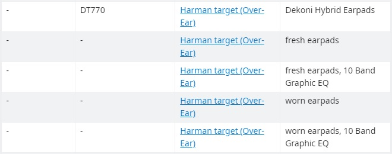
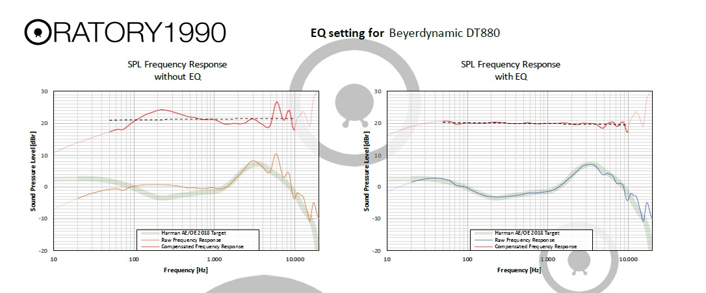
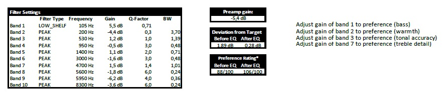
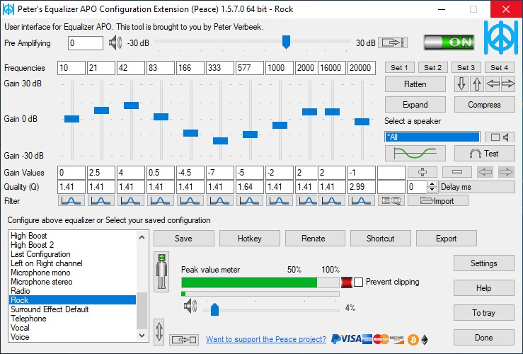
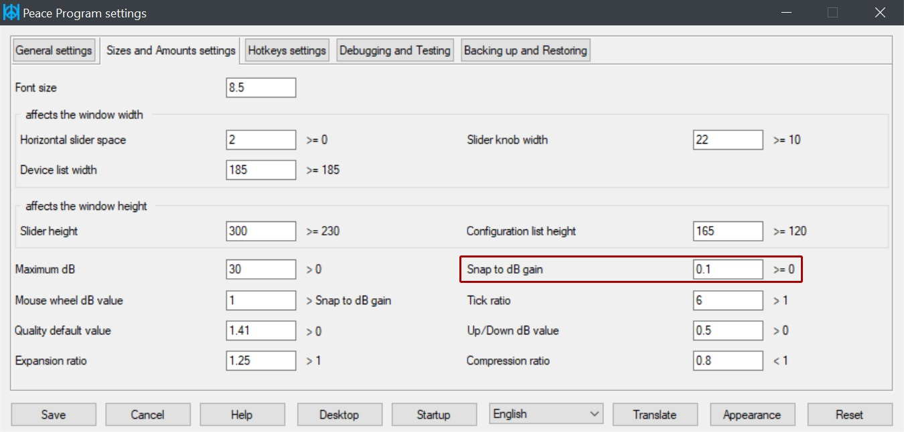

## Step-by-step guide

1. Go to the Reddit page for [oratory1990's list of presets](https://www.reddit.com/r/oratory1990/wiki/index/list_of_presets).
2. Find your headphone model. If you can't see your headphones on the list, ask oratory1990 directly through Reddit – he might consider testing them and adding the preset in the future.
3. Your headphone model may have a few different presets depending on a specific setup, e.g. for fresh or worn earpads (newly bought vs. older pair). Choose the right preset for your case.
  
4. Download the PDF file by clicking on the relevant link. The link will redirect you to dropbox, but you don't need to have an account there – just close the alert box and continue to click on the *download* button.
5. Open and inspect the PDF file you have downloaded. You should see various graphs and settings. The first two graphs show you the comparison of your headphones' native frequency response against the Harman target curve – before and after equalization. At the bottom of the page you will see filter settings which you will apply later.
  
  
1. Download [Equalizer APO](https://sourceforge.net/projects/equalizerapo/). If you are on macOS, check [the troubleshooting section](https://komunikacjatechnicznavistula.github.io/kacper-bojakowski/manual/troubleshooting/#troubleshooting) of this guide.
2. Install Equalizer APO. At one point during the installation, you will have to choose the sound driver you use. If unsure, check in the manual for your soundcard/DAC.
3. Download and install [Peace GUI](https://sourceforge.net/projects/peace-equalizer-apo-extension/). Equalizer APO is an equalization environment with a very simple graphical interface; to navigate through the EQ comfortably, you will need a better GUI – such as Peace.
4.  Open Peace and choose *Full interface*; the simple one doesn't offer enough settings for your needs. In the end, your Peace should look something like this:  
  
5.  Click on *Settings* in the bottom right corner. Then, choose *Size and Amounts settings* tab at the top. There, find *Snap to dB gain* option and set it to 0.1 so you can adjust decimal values with the right accuracy. Save the settings and get back to the main screen.
  
6.  Adjust the preamp gain (*Pre Amplifying*, at the top), and all the bands for filter type, frequency, gain, and q-factor values, according to the PDF file for your preset. Don't worry if there are more bands in the equalizer than in the instructions for your preset – adjust only as many bands as you need (most of oratory1990's presets are for 10 bands), and set gain value to 0 for the rest. Alternatively, you can delete the extra bands completely by clicking on the minus sign on the right.
7.  Play a song in your favourite music player and check if you hear the difference when you click on the *ON/OFF* switch in the top right corner of Peace APO.

---

*Next topic: [Troubleshooting](https://komunikacjatechnicznavistula.github.io/kacper-bojakowski/manual/troubleshooting/#troubleshooting)*
