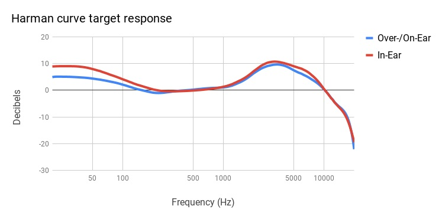

## Harman target

  

### What is the Harman target?

There are various curves of frequency response – so-called targets – towards which audio manufacturers calibrate drivers in their headphones. One of them is the Harman Target Curve. Developed by acousticians from Harman International, it is a frequency response curve that many experts and critical listeners accept as a staple of reference tonality for headphones.

Unlike some other response curves, Harman target is not "flat", i.e. it doesn't aim for a sound signature level throughout the whole frequency spectrum. The reasoning behind it is that flat frequency response, preferable as it is for speakers, is unfit for headphones due to their inherent acoustic properties. Speakers placed in a room produce soundwaves that bounce off the walls and resonate with various objects before they reach the listener's ears. In these circumstances, bass and treble frequencies get naturally emphasized even if the speakers themselves produce a relatively flat signature when measured in isolation. The Harman target is designed to mimic this scenario by boosting certain frequencies so as to compensate for poorer acoustic environment of headphones. The goal is to have headphones sound like speakers in a well-adapted room.

---

*Next topic: [Equalization](https://komunikacjatechnicznavistula.github.io/kacper-bojakowski/theory/Equalization/)*
